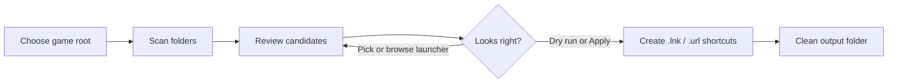

# Game Shortcut Maker

[](https://github.com/erichuang1425/GameShortcutMaker/actions/workflows/tests.yml)

Turn a messy Windows game library into a clean folder of launchable shortcuts.

Game Shortcut Maker is a PySide6 desktop app for people who keep DRM-free,
portable, archived, indie, HTML, or Flash games in folders. Point it at a game
root, review what it found, and apply shortcuts to an output folder only when
you are ready. It is cautious by design: dry runs are supported, existing
shortcuts are skipped unless a newer version is detected, replacements are
backed up, and the last apply can be undone.



## Highlights

- **Launcher detection for real-world folders**: ranks executables by title
  match, depth, size, and launcher-like names while filtering installers,
  redistributables, crash handlers, config tools, and uninstallers.
- **HTML and Flash support**: creates `.url` shortcuts for HTML entry points and
  `.lnk` shortcuts for `.swf` files when a folder has no executable launcher.
- **Collection mirroring**: detects folders that are really collections of
  games and mirrors their nested structure in the output folder.
- **Review before write**: inspect every result, filter/search the table, choose
  a different launcher, select multiple launchers, or browse manually.
- **Safe shortcut updates**: skips existing shortcuts, replaces only when a
  newer folder version is detected, backs up replaced shortcuts, and supports
  undo for the last run.
- **Better icon handling**: chooses the largest embedded launcher icon, can
  upscale small icons into a cached `.ico`, and can refresh existing shortcut
  icons without re-scanning the library.
- **Folder cleanup helper**: optionally flattens redundant single-child nesting
  such as `Game/Game/v1.2/files` into a cleaner game folder.
- **Large-library ergonomics**: background workers keep scans responsive, cached
  confirmations reduce repeated choices, and apply errors are categorized with
  logs.

## Tech Stack

- **Python 3.9+**
- **PySide6 / Qt** for the Windows desktop interface
- **pywin32 / COM** for native `.lnk` shortcut writing
- **pytest** for the pure logic test suite
- **GitHub Actions** for cross-platform CI

## Requirements

Shortcut creation is Windows-specific because it uses native Windows shortcut
APIs. The pure scan/classification/scoring tests run cross-platform.

```bash
pip install -r requirements.txt
```

## Run

```bash
python main.py
```

Typical workflow:

1. Choose the folder that contains your game folders.
2. Choose an output folder for shortcuts.
3. Scan and review the results.
4. Confirm or browse for launchers that need manual attention.
5. Run a dry run, then apply when the preview looks right.

## Build

Create a standalone Windows executable with PyInstaller:

```bash
pyinstaller main.py --onefile --windowed
```

## Testing

Run the cross-platform test suite:

```bash
pytest tests/ -v
```

The GUI and actual Windows shortcut-writing path require Windows, but the core
classification, scoring, storage, icon parsing, and path helpers are covered by
unit tests.

## Project Structure

| Path | Purpose |
| --- | --- |
| `main.py` | Process entry point. |
| `app.py` | Thin `run_app()` wrapper for the Qt app. |
| `ui/` | Main window, dialogs, workers, and theme styling. |
| `scanner.py` | Folder traversal and launcher candidate discovery. |
| `collection.py` | Recursive game-vs-collection classifier. |
| `exe_scoring.py` / `html_scoring.py` | Launcher ranking heuristics. |
| `rules.py` | Default ignore rules for installers, redistributables, and tools. |
| `shortcut_manager.py` | Shortcut creation, replacement, backup, cleanup, and icon wiring. |
| `icon_extract.py` | Embedded icon group parsing and `.ico` generation support. |
| `storage.py` | Settings, cached choices, shortcut index, logs, and migrations. |
| `squash.py` | Safe planning/execution for redundant folder flattening. |
| `versioning.py` | Version parsing and comparison from folder names. |
| `tests/` | Unit tests for pure logic and cross-platform helpers. |
| `docs/TUNING.md` | Collection thresholds and launcher scoring notes. |

## Configuration Notes

Most users can leave the defaults alone. If your library has unusual nesting or
HTML launcher conventions, see [docs/TUNING.md](docs/TUNING.md) for the
collection threshold, depth limit, and HTML launcher score coupling.

Ignore patterns can be adjusted from the app so repeated false positives like
setup tools or engine utilities stay out of future scans.

## Roadmap

- Surface unreadable folder counts directly in the review UI.
- Add user-editable scoring hints for project-specific launcher names.
- Improve non-Windows degradation so scan/review remains useful even when
  shortcut writing is unavailable.
- Add a small visual gallery once stable screenshots are captured on Windows.

## Release

Current recommended release: **v1.1.0**.

Suggested release summary:

> Game Shortcut Maker now handles nested game collections, HTML and Flash
> launchers, safer shortcut updates, manual launcher selection, folder
> flattening, improved icon selection and refresh, better apply diagnostics,
> and a broader test suite for the core scanning logic.

## License

No license file is currently included. Add one before accepting outside
contributions or reuse requests.
